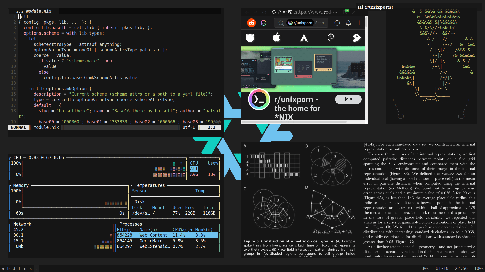

## Introduction

[tinted-theming (continuation of base16)](https://github.com/tinted-theming/home) is a framework with
hundreds of colorschemes and application configuration templates.

`base16.nix` combines the expressiveness of Nix with the abundance of tinted-theming to help you theme your setup.

### Features

With `base16.nix`, you can:
- load base16 **and base24** schemes, override them or specify custom ones in YAML / nix, to use across the configuration;
- theme applications with existing or custom templates.

Note that `base16.nix` is a simple theming interface, **not** an all-batteries-included ricing engine — but if you want one, check out [Stylix](https://github.com/danth/stylix), which, among other things, complements `base16.nix` functionality with pre-defined configuration for common application.

## 👀 Tutorial by Example

In this tutorial, we will use `base16.nix` as a NixOS module to theme
`zathura`, `neovim` and `alacritty` to use the `nord` scheme
(home-manager module works the same way).

### Import and set the scheme (step 1/2)

In your NixOS configuration directory:

`flake.nix`
```nix
{ inputs = {
  # Add base16.nix, base16 schemes and
  # zathura and vim templates to the flake inputs.
  base16.url = "github:SenchoPens/base16.nix";

  tt-schemes = {
    url = "github:tinted-theming/schemes";
    flake = false;
  };

  base16-zathura = {
    url = "github:haozeke/base16-zathura";
    flake = false;
  };

  base16-vim = {
    url = "github:tinted-theming/base16-vim";
    flake = false;
  };
  ...
};
outputs = { self, ... } @ inputs {
  ...
    nixosSystem {
      modules = [
        # import the base16.nix module
        base16.nixosModule
        # set system's scheme to nord by setting `config.scheme`
        { scheme = "${inputs.tt-schemes}/base16/nord.yaml"; }
        # import `theming.nix`, we will write it in the next, final, step
        ./theming.nix
        ...
      ];
      # so you can use `inputs` in config files
      specialArgs = {
        inherit inputs;
      };
      ...
    };
  ...
};
... }
```

### Theme (step 2/2)

Now that `config.scheme` is set, we can use it like a function to
create themes from templates.

`theming.nix`
```nix
{ config, pkgs, inputs, ... }:
{
  # Theme zathura
  home-manager.users.sencho.programs.zathura.extraConfig =
    builtins.readFile (config.scheme inputs.base16-zathura);

  # Theme `neovim` — more complex, but the principle is the same.
  home-manager.users.sencho.programs.neovim = {
    plugins = [ (pkgs.vimPlugins.base16-vim.overrideAttrs (old:
      let schemeFile = config.scheme inputs.base16-vim;
      in { patchPhase = ''cp ${schemeFile} colors/base16-scheme.vim''; }
    )) ];
    extraConfig = ''
      set termguicolors background=dark
      let base16colorspace=256
      colorscheme base16-scheme
    '';
  };

  # Theme `alacritty`. home-manager doesn't provide an `extraConfig`,
  # but gives us `settings.colors` option of attrs type to set colors. 
  # As alacritty expects colors to begin with `#`, we use an attribute `withHashtag`.
  # Notice that we now use `config.scheme` as an attrset, and that this attrset,
  # besides from having attributes `base00`...`base0F`, has mnemonic attributes (`red`, etc.) -
  # read more on that in the next section.
  home-manager.users.sencho.programs.alacritty.settings.colors =
    with config.scheme.withHashtag; let default = {
        black = base00; white = base07;
        inherit red green yellow blue cyan magenta;
      };
    in {
      primary = { background = base00; foreground = base07; };
      cursor = { text = base02; cursor = base07; };
      normal = default; bright = default; dim = default;
    };
}
```

That's all, we themed 3 applications!

<blockquote>

The attentive reader will notice that after setting `config.scheme` to a <ins>string</ins>,
we use it as a <ins>function</ins> (to theme `zathura` and `neovim`)
and as an <ins>attrset</ins> (to theme `alacritty`) — that's `base16.nix`' magic!
Read the **Documentation** section to see how it works.
</blockquote>


## 🍳 How To

<details><summary>Import a scheme from a YAML file</summary><blockquote>

```nix
config.scheme = "${inputs.tt-schemes}/base16/nord.yaml";
```
</blockquote></details>

<details><summary>Override a scheme</summary><blockquote>

We need to explicitly use `mkSchemeAttrs` function
to use the `override` field of the resulting _scheme attrs_:
```nix
config.scheme = (config.lib.base16.mkSchemeAttrs "${inputs.tt-schemes}/base16/nord.yaml").override {
  scheme = "Now it's my scheme >:]";
  base00 = "000000";  # make background completely black
};
```
</blockquote></details>

<details><summary>Declare a scheme in Nix</summary><blockquote>

```nix
config.scheme = {
  slug = "balsoftheme"; scheme = "Theme by balsoft"; author = "balsoft";
  base00 = "000000"; base01 = "333333"; base02 = "666666"; base03 = "999999";
  base04 = "cccccc"; base05 = "ffffff"; base06 = "e6e6e6"; base07 = "e6e6e6";
  base08 = "bf4040"; base09 = "bf8040"; base0A = "bfbf40"; base0B = "80bf40";
  base0C = "40bfbf"; base0D = "407fbf"; base0E = "7f40bf"; base0F = "bf40bf";
};
```
[source](https://code.balsoft.ru/balsoft/nixos-config/src/branch/master/modules/themes.nix)
</blockquote></details>

<details><summary>Use multiple schemes simultaneously</summary><blockquote>

Achieve this by theming without `config.scheme` — by calling `mkSchemeAttrs`:
```nix
home-manager.users.sencho.programs.zathura.extraConfig =
  builtins.readFile (config.lib.base16.mkSchemeAttrs inputs.tt-schemes inputs.base16-zathura);
```

Without importing `base16.nix` as a module at all:

```nix
home-manager.users.sencho.programs.zathura.extraConfig =
  builtins.readFile ((pkgs.callPackage inputs.base16.lib {}).mkSchemeAttrs inputs.tt-schemes inputs.base16-zathura);
```

</blockquote></details>

<details><summary>Use template variation</summary><blockquote>

Template repositories often define more than one template variation.
For example, [zathura template repository](https://github.com/HaoZeke/base16-zathura)
defines `default.mustache` (colors only the interface) and `recolor.mustache`
(colors the interface and pdfs).

By default `base16.nix` uses `default.mustache`.
To use another template, e.g. `recolor.mustache`:
```nix
home-manager.users.sencho.programs.zathura.extraConfig =
  builtins.readFile (config.scheme {
    templateRepo = inputs.base16-zathura; target = "recolor";
  });
```
</blockquote></details>

<details><summary>Override a template</summary><blockquote>

Sample use-case:
suppose you like `zathura`'s `default.mustache` template,
but want to change the background (`default-bg`) from `base00` to `base01`.

1. Override the scheme only for `zathura`:
```nix
home-manager.users.sencho.programs.zathura.extraConfig =
  builtins.readFile ((config.scheme.override {
    base00 = config.scheme.base01;
  }) inputs.base16-zathura);
```
Keep in mind that by doing so you'll change not only
`default-bg` color, but also `inputbar-bg`, `notification-bg`, etc.

2. Copy-paste the template and modify it:
```nix
home-manager.users.sencho.programs.zathura.extraConfig =
  builtins.readFile (config.scheme { template = ''
    ... 
    set default-bg   "#{{base01-hex}}"  # <-- we changed this
    set default-fg   "#{{base01-hex}}"

    set statusbar-fg "#{{base04-hex}}"
    set statusbar-bg "#{{base02-hex}}"
    ...
  ''; });
```
</blockquote></details>


## 📚 Documentation

Consult the [DOCUMENTATION.md](DOCUMENTATION.md) to learn about every feature in
detail and see how `base16.nix` works underhood.


## ☎️ Troubleshooting

<details><summary>Error / incorrect behavior after updating base16.nix or adding a new source / template</summary><blockquote>

The most probable reason of such an error is incorrectly parsed YAML file of either a scheme or a template.

### Fix incorrectly parsed YAML file

- Enable IFD (but beware of a possible error described below):
  If the problem is in the scheme YAML file, set the scheme as such:
  ```nix
  config.scheme =  {
    yaml = "${inputs.tt-schemes}/base16/nord.yaml";
    use-ifd = "auto";  # to suppress errors, set to "always"
  };
  ```
  If the problem is in the template `templates/config.yaml` file, turn on `use-ifd`:
  ```nix
  home-manager.users.sencho.programs.zathura.extraConfig =
    builtins.readFile (config.scheme {
      use-ifd = "always";
      templateRepo = inputs.base16-zathura; target = "recolor";
    });
  ```
- If you think that it's safe to ignore the error on template instantiation, you can turn off the check:
  ```nix
  home-manager.users.sencho.programs.zathura.extraConfig =
    builtins.readFile (config.scheme {
      check-parsed-config-yaml = false;
      templateRepo = inputs.base16-zathura; target = "recolor";
    });
  ```
- If the problem is with a scheme YAML file and the nix evaluates, add the `config.scheme.check` derivation to your NixOS / home-manager package list, this will indicate which part of the YAML is being parsed incorrectly.
- Submit an issue.
- Fix the YAML upstream. Probable causes: trailing spaces, file structure differs from typical `config.yaml` / scheme YAML files.
- Fix the Nix parser 😈.

Context: since version v2.0.0 `base16.nix` parses the YAML file in pure Nix to bypass IFD issues.
The parser works for most `base16-<scheme-name>.yaml` and templates' `config.yaml` files, but,
as YAML can be quite complicated, sometimes they can be parsed incorrectly.

The exact error depends on the point of failure.
It will probably be cryptic if incorrect parsing caused an issue during nix evaluation.
Otherwise, if your flake evaluates (`nix flake check` succeeds), the error may look something like this:
```
error: builder for '/nix/store/snbbfb43qphzfl6xr1mjs0mr8jny66x9-base16-nix-parse-check.drv' failed with exit code 1;
       last 7 log lines:
       > running tests
       > Output of "jd /nix/store/9jvxabhfx9acrysknblg0r2hzvcwv6ab-fromYAML /nix/store/qwmj9cbg7fpi5fvyd2x3kywfbw7hlm8f-parsed-yaml-as-json":
       > @ ["gotcha"]
       > - ["1 2"]
       > + "[ 1 2 ]"
       > Error: /nix/store/qhdqwj0mfp8qn0gq5s95pgd2i57lb09c-source/base16-kandinsky.yaml was parsed incorrectly during nix evaluation.
       > Please consult https://github.com/SenchoPens/base16.nix/tree/main#%EF%B8%8F-troubleshooting
```
The check that produces this error happens by default for templates by installing a special derivation. You can do it for scheme too by adding the `config.scheme.check` derivation to your NixOS / home-manager package list, though you might need to set the scheme to `{ yaml = ...; use-ifd = "auto"; }`. 

</blockquote></details>

<details><summary>Error on `nix flake check` or `nix flake show`</summary><blockquote>

First, check that you have the most recent version of `base16.nix`.
If the error persists, check that you don't set `use-ifd` anywhere to `"auto"` or `"always"`.

Relevant issue: #3.

If neither of the above listed solutions do not work for you, please open an issue.
</blockquote></details>

Anyhow, feel free to open an issue!

## 💙 Acknowledgments

Thanks to:
- @balsoft for [nixos-config](https://code.balsoft.ru/balsoft/nixos-config),
  which inspired this library;
- @pinpox for [this post](https://pablo.tools/blog/computers/nix-mustache-templates/),
  which I used to implement the mustache template instantiation;
- @DavHau for [fromYaml](https://github.com/DavHau/fromYaml);
- @cab404 for [Genix7000 — icon generator for nix projects](https://github.com/cab404/genix7000);
- @chriskempson for base16;
- @belak and [tinted-theming](https://github.com/tinted-theming/)
  for growing the base16 ecosystem;
- @mmanchkin for being a great support and **mastermind** behind all of this.


## 👩‍💻 Contributing

Contributions are highly welcome, but please keep in mind I want to keep the code compact.

### Testing
To test the module, you can do the following:
1. Set the flake url to the fork's absolute path: `base16.url = "/home/sencho/github.com/SenchoPens/base16.nix";`.
2. Build the configuration:

```sh
nix flake lock --update-input base16
nixos-rebuild build --flake . --fast  # NixOS
home-manager build --flake . --no-out-link  # home-manager
```

Note that you don't have to commit the changes to test them.
