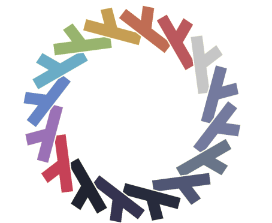

# base16.nix

## Features
This flake provides:
- a function to create a scheme attrset from a scheme,
  that can further be used to create themes from templates.
- a NixOS module,
- a home-manager module.

## Nonfeatures
This project does not attempt to:
- aggregate schemes or templates,
- support EJS templates, which are part of the
[base16-builder/base16-builder](https://github.com/base16-builder/base16-builder)
repository, as it has been long time abandoned and almost all of the EJS templates
have mustache alternatives.
- be able to generate wallpapers from schemes,
- be able to generate schemes from wallpapers.

## Usage as a module
In this example, we will use base16.nix as a NixOS module to theme
`fzf`, `zathura`, `alacritty` and `vim` to use colors of
[eva scheme](https://github.com/kjakapat/eva-theme) and @balsoft scheme
(home-manager module works the same way).

First, let's add base16.nix, `eva` scheme and `fzf`, `zathura` and `vim` templates to flake inputs:
```
inputs = {
  ...
  base16.url = "/home/sencho/code/github.com/SenchoPens/base16.nix";
  base16.inputs.nixpkgs.follows = "nixpkgs";

  # sample scheme
  base16-eva-scheme = {
    url = github:kjakapat/base16-eva-scheme;
    flake = false;
  };

  # sample templates
  base16-fzf = {
    url = github:fnune/base16-fzf;
    flake = false;
  };

  base16-zathura = {
    url = github:haozeke/base16-zathura;
    flake = false;
  };

  ...
};
```

## Examples

## Exported packages

## Alternatives
- [base16-nix](https://github.com/atpotts/base16-nix) by @atpotts and its forks, notably
[base16-nix](https://github.com/AlukardBF/base16-nix) by @AlukardBF and [base16-nix](https://github.com/lukebfox/base16-nix) by @lukebfox,
- [nix-colors](https://git.sr.ht/~misterio/nix-colors) by @misterio,
- [theme-base16](https://gitlab.com/rycee/nur-expressions/-/tree/master/hm-modules/theme-base16) by @rycee.

## Acknowledgments
Thanks to:
- @balsoft for [nixos-config](https://code.balsoft.ru/balsoft/nixos-config),
  which inspired this library;
- @cab404 for [genix7000 - icon generator for nix projects](https://github.com/cab404/genix7000);
- @chriskempson for creating [base16](https://github.com/chriskempson/base16)
  and @belak for maintaining it;

## Contributing
See [CONTRIBUTING.md](CONTRIBUTING.md)
